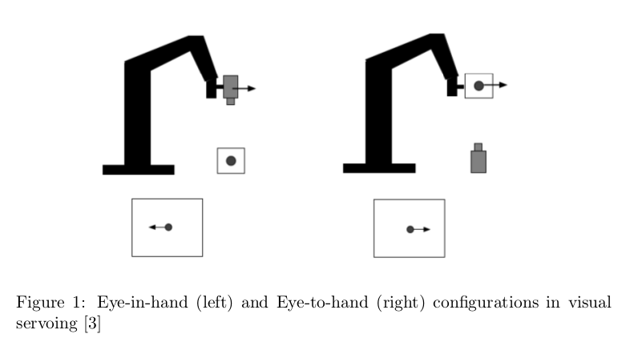
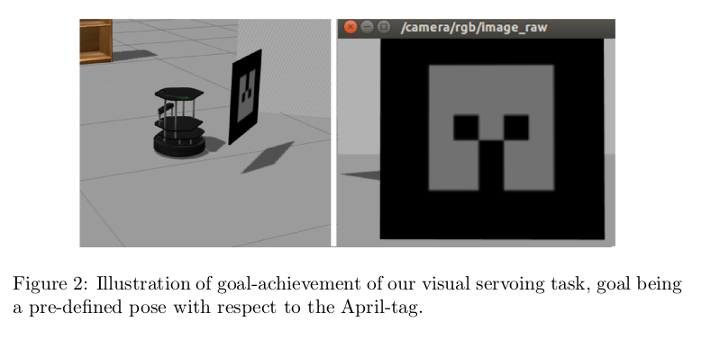
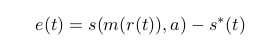
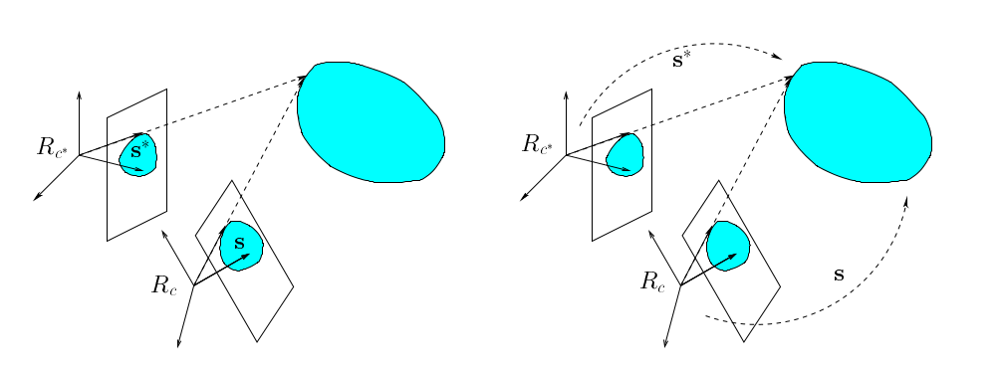
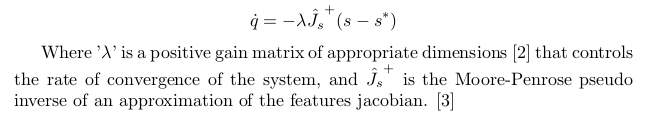
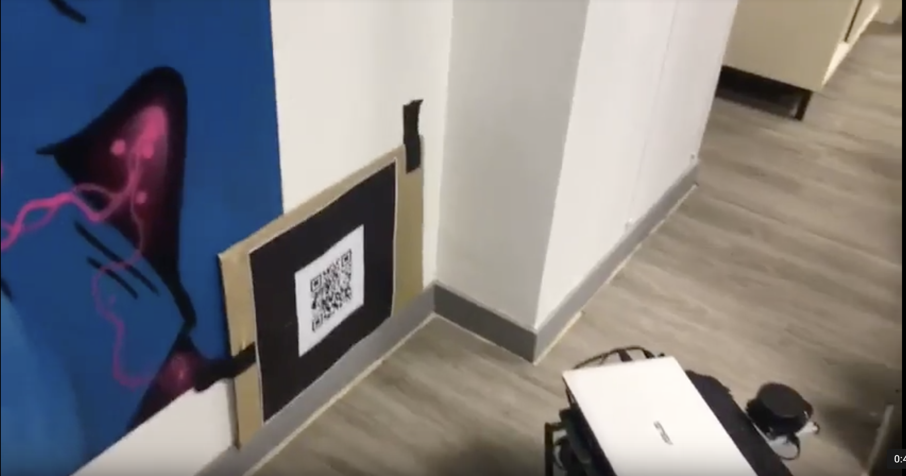
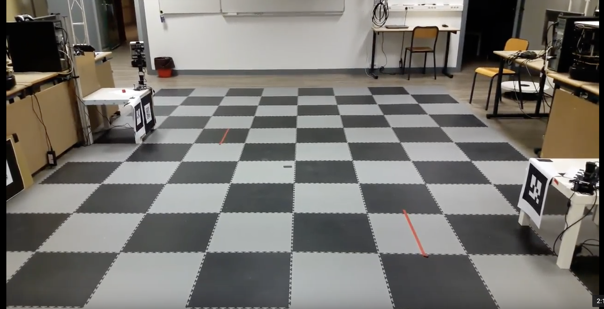

# ROS - Visual Servoing PBVS

#### This repository is organized as follows: all the codes are available under master branch but also under each specific branch owning the same name as the code. The explanations on this readMe are about Visual Servoing in general, and birds-eye-view of our project. To find out details regarding running our implementations, please refer to the specific readMe's.

**Table-of-contents**

* [Project](#project)
* [Visual Servoing](#visualservoing)
* [Getting a template in the Gazebo world](#getting-a-template-in-the-gazebo-world)
* [Materials-Videos](#materials)
* [MultiMaster and Task Combination](#multimaster-and-task-combinations)

More description is given in the subsections.

## Project

The project is developped under **ROS** environment and using **Ubuntu 14.04 LTS** with a **TurtleBot** runing on **indigo**. 
The key idea of the project is to develop an application runing on the robot to solve a navigation / object displacement problem.
This big picture can be sub-divided into 3 parts, Navigation, Visual Servoing and Pick & Place. The related work has been performed on Visual Servoing Part.
The goal of the Fine Positionning task is to be able to move from the landing position of the navigation program to a table where a robotic arm will operate.

## VisualServoing
Visual servoing refers to closed loop position control of a robot end-effector, using measurements from a vision sensor [2]. Two kinds of configurations for visual servo control are most frequently encountered in literature:
1. Eye-in-hand
2. Eye-to-hand

Here, we are interested in the Eye-to-hand configuration since the task we consider is precise positioning of a mobile robot (Turtlebot2) using images acquired from a camera (Kinect V1) mounted on it.

Most visual servoing methods in literature are closed-loop control schemes that regulate some error, ’e(t)’, to zero. This error is a discrepancy between features ,’s()’,based on measurements, ’m(.)’, obtained from images available at current pose of the camera, r(t), and features,s ∗ (t) , expected from measurements on images when camera is at ’goal’ pose [3].

### PBVS - Pose Based Visual Servoing
Also called dynamic position-based look-and-move, ’s()’ is a set of 3D parameters related to relative pose between camera and target object

### IBVS - Image Based Visual Servoing 
Also called dynamic image-based look-and-move, ’s()’ is a set of 2D parameters directly expressed in image, some possible 2D parameters being image plane coordinates of feature points, line segments, centroid and other moments of regions of interest, and so on.

Figure : Left IBVS, and right, PBVS, from [3].

Finally, for both IBVS and PBVS, the velocity of the camera (mounted on the end effector) is computed as follows:

### References
[1] Wikipedia contributors. ”Visual servoing.” Wikipedia, The Free Encyclopedia. Wikipedia, The Free Encyclopedia, 17 Sep. 2017. Web. 1 Nov. 2017.

[2] S. Hutchinson, G. Hager, and P. Corke, “A tutorial on visual servo control,” IEEE Trans. Robot. Automat. vol. 12, pp. 51–670, Oct. 1996

[3] Visual servoing, Francois Chaumette, Inria, Rennes, France In Computer Vision: a Reference Guide, K. Ikeuchi (ed.) pp. 869-874, Springer, 2014.

### Comparison of Processes & choices of implementation
In our experience, the pose-based method that relied on automatic detection of a QR tag of known dimensions was limited in its range of detection. These possibly came from limitations of the visp-auto-tracker.

Our implementation (using ViSP) of points based IBVS offerred a significantly better range, while it requiring manual initialization of points (blobs/dots) that were to be tracked ('S' = {4 points}, see above).

In later stages of our development, we felt that our pose-based approach based on the 'demo-pioneer' (see readMe on PoseBased branch) was more opaque and afforded us less control and room for experimentation than our Points based approach. 
 

## Getting a template in the Gazebo world:
Create a folder containing your template in 'gazeboResources' into your gazebo resources directory. For reference, check the 'models/marker0' folder in IBVS_PointsBased' branch.

Usually, this is a hidden folder in your 'home' directory, named '.gazebo'. Paste the folder inside '.gazebo/models/'. In your Gazebo, you'll now be able to 'insert' your template, check the insert pane!

Now, your template should be available in the 'insert' pane of Gazebo.

## Materials

### PBVS - Pose Based Visual Servoing

Our 'PoseBased' (see branch 'PoseBased') implementation 'enables' visual servoing only once it receives a std_msgs/String 'navdone' on topic named 'nav_status'.

#### Video of the code live on robot

#### Video of simulation

### IBVS - Qr Point Based Visual Servoing 
This implementation is not working due to perspective and bad projection of the tagrget. The problem can be solved by using image pre-processing to re-align the target and compute the provided program.
The decision to move on another project (**IBVS - Blob Point Based Visual Servoing**) has been done in order to complete an IBVS process with a correctly estimated working-time instead of spending time on something that could take much longer.

### IBVS - Blob Point Based Visual Servoing 
#### Real View

#### Computer View

## MultiMaster and Task Combinations
Our 'PoseBased' (see branch 'PoseBased') implementation 'enables' visual servoing only once it receives a std_msgs/String 'navdone' on topic named 'nav_status'.

This is meant for the package to be integrable into a larger project with several stages, fine positioning being one of them, using some scheme to share messages between roscores running on separate computers on a network. For reference, please see the multimaster repo linked below:

Multimaster : https://github.com/Dtananaev/ROS_nodes

### Video of combined project [Navigation](https://github.com/gopi231091/Mapping_LocalizationOfARMarkers_Navigation_ROS_Turtlebot#repository) - Fine Positionning ( this project ) 

Pick and place addition in the combination process is coming soon !
